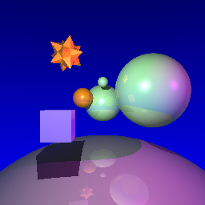
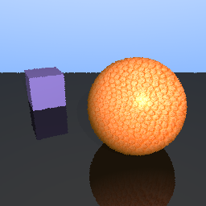
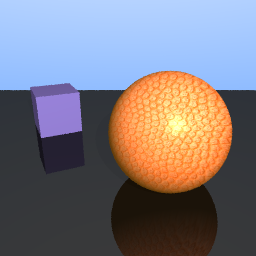

# 📸 Ray Tracer: Animated Scene Rendering
**Author:** Beenish Khan  

A high-performance C++ Ray Tracer developed to simulate realistic light transport and physics-based interactions to create a 10s 3D Lua animation. This project follows the architecture of **"Ray Tracing in One Weekend"** and extends it with advanced rendering objectives.

---

## 🎯 Project Objectives
1. **Texture Mapping:** Spherical UV mapping using the LodePNG library.
2. **Shadows:** Shadow ray casting with Epsilon offsets.
3. **Reflections:** Recursive ray tracing for mirror-like surfaces.
4. **Two Interacting Primitives:** Physics-based interaction (bouncing ball and plane).
5. **Sound:** Synchronized audio for spatial interaction.
6. **Anti-Aliasing (Extra):** Multi-sampling per pixel for smoothed edges.

---

## 🚀 Build & Run Instructions
1. Run "premake4 gmake" in ./A4
2. Run "make" in ./A4
3. Navigate to ./A4/Assets
4. Run ../A4 [lua animation] eg. ani.lua or ani2.lua

---

## 🎬 Project Animation

  <video src="https://github.com/user-attachments/assets/00fa2605-731e-427d-9e34-0e96badbe482" width="800" controls autoplay loop>
    Your browser does not support the video tag.
  </video>
  

    <em>Animation 1: 10-second Lua animation with synchronized audio.</em>
  

---

## 🛠 Technical Outline

### 🎨 Texture Mapping
**Texture mapping** is achieved by loading texture images using the **LodePNG** library. To map textures onto 3D spheres, a `spherical_map` function converts surface points to UV coordinates. The coordinates are then used to retrieve the color of the texture using the `uv_pattern_at` function. Finally, the `get_color` function combines these processes to determine the color of a pixel on the textured surface. Users can specify texture files via the `set_texture` function in the **Lua** configuration files.

### 🌖 Shadows
Shadows are implemented using **Shadow Ray Casting** (Cook, 1984). For each intersection point found along a primary ray, a shadow ray is cast toward each light source. If an object is intersected before reaching the light, the point is marked in shadow. To prevent **"shadow acne"** caused by floating-point precision errors, an **EPSILON** value ensures rays start slightly away from the surface to avoid self-intersections.

### 🪞 Reflection
Reflection involves calculating a reflected ray direction based on the incoming ray and the surface normal at the point of intersection. By tracing these rays recursively, multiple levels of reflection are simulated (De Greve, 1984). Reflective properties are assigned to specific nodes via the project's **Lua** configuration files.

   
  <em>Figure 1: Demonstration of recursive reflection and shadow ray casting.</em>

### ⚽ Interacting Primitives & Mesh
The scene features a plane and a spherical ball interacting through a bouncing animation. Mesh triangle intersections are handled via logic adapted from the **OglWalker** geometry operations.

### 🔊 Sound & Anti-Aliasing
*   **Sound:** A ball-bouncing sound effect was synchronized with the animation using **Kapwing**.
*   **Anti-Aliasing:** Implemented as an extra feature using multi-sampling. While functional for high-fidelity stills, it was toggled off for the final 10s video render to manage computational load.

  <table>
    <tr>
      <td align="center">
         
        <em>Without Anti-Aliasing</em>
      </td>
      <td align="center">
         
        <em>With Anti-Aliasing</em>
      </td>
    </tr>
  </table>
  
<em>Figure 2: Comparison showing the effect of multi-sampling on edge smoothness.</em>

---

## 🏗 Sources & References
*   **Core Guide:** [Ray Tracing in One Weekend](https://raytracing.github.io) by Peter Shirley.
*   **Mapping Logic:** [Ray Tracer Challenge Texture Mapping](http://raytracerchallenge.com) (Jamis Buck).
